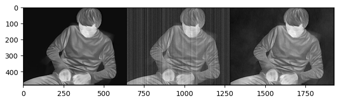
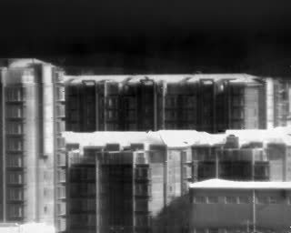

# DIP-TV in application to infrared thermal images

This repository is a standalone reproduction of [Liu et al. (2023)](https://www.sciencedirect.com/science/article/abs/pii/S1350449523003468).

Key highlights:
- Better introduction, summary, and documentation of the methodology.
- Additional implementation of denosing method and direct comparisons.
- Rewrote and enhanced codebase with comments for better compatibility and performance.

Picture:



Video:



## 1. Introduction

[Deep Image Prior](https://arxiv.org/pdf/1711.10925) is a technique introduced by **Ulyanov et al. (2018)** that leverages the **structure** of convolutional neural networks (CNNs) as a regularizer for image restoration tasks, without requiring any pretraining or external datasets. The idea is that even with a random input vector, CNN without any supervised training can reproduce the clear image on a large dataset. 

In a general unsupervised image restoration task, we consider the following generative process

$x^* \to degradation/corruption/mask \to x_0 \to resotration \to \hat{x}$

Given observation $x_0$, the objective is to find the best restored image $\hat{x}$ that similar to $x^*$. It can be approached by the following framework

### 1.1 Image Restoration as Empirical Risking minimization of Inverse Problem

$\hat{x}_{ERM}= \arg\min_{x} E(x,x_0) + R(x) $

where 
- $ x \in \mathbb{R}^{rH \times rW \times C} \quad \rightarrow \quad \text{potential inpainted/denoised/super-resolved image} $  
- $ x_0 \in \mathbb{R}^{H \times W \times C} \quad \rightarrow \quad \text{masked/corrupted/low resolution image} $
- E(x,x_0) measures the loss of data fidelity in the generation process from $x$ to $x_0$
    - For super-resolution tasks, the super-resolved upsampling factor r >1 and $E(x,x_0)= ||d(x)-x_0||_2^2$, where **Downssampling operator** $d: \mathbb{R}^{H \times W \times C} \rightarrow \mathbb{R}^{rH \times W \times C} $ (i.e., downsampled image should match with x_0)
    - For denosing tasks, the tasks-related factor r =1 and $E_\theta(x,x_0)= ||x-x_0||_2^2$  (i.e., clean image should be similar to x_0/the noise added should be small)
    - For inpainting tasks, the tasks-related factor r <1 and $E_\theta(x,x_0)= ||m ☉ (x-x_0)||_2^2$, where binary **masking operator** $m: \mathbb{[0,1]}^{H \times W \times C}$ (i.e., the rest of the unmasked should match)
- $R_\theta(x)$ is the regularization terms.


### 1.2 Image Restoration as Maximum-A-Posterior Estimation(MAP).

If the generation of $x$ is random  $p(x_0|x^*)$ and we have prior information of $p(x^*)$, then the above objective can be interpreted finding a MAP in Bayesian inference.

$\hat{x}_{MAP}= \arg\max_{x}\log p(x|x_0) = \arg\min_{x}[-\log p(x_0|x)+ -1*\log p(x)]$

where 
- the negative log-likelihood $-\log p(x_0|x):=E(x,x_0)$ is how likely to observe $x_0$ if the underlying true image is $x$, 
- $\log p(x):=R(x)$ is the prior probability of true image. 

*This characterization does not explicitly involve a learnable parameter $\theta$, which helps to understand the meaning of $E(x,x_0)$ and why the regularization $R(x)$ can be interpreted as prior* 

### 1.3 What is a good prior/regularization in a unsupervised form?

Choice of $R(x)$ in a unsupervised setting:
- $R(x)=0$ if $x=x^*$ and $R(x)=+\infty$ if otherwise: unrealistic; true clean image is generally unknown in a unsupervised setting.
- $R(x)=0$ if $x=x_0$ and $R(x)=+\infty$ if otherwise: not good enough; Overfitting to corrupted/low resolution images.
- $R(x)=$ Total Variation of the image: not data-dependent;

## 2. DIP: CNN as a regularizer.

DIP formulated $\hat{x}_{DIP}= f_\theta^*(z_1), where $\theta^*= argmin_\theta E(f_\theta(z_2),x_0)$, where $z$ denotes the random input vectors. 

The CNN generator is initialized with random variables $\theta$, and these variables are iteratively optimized so that the output of the network is as close to the target measurement as possible.

Key Insights:

- No regularization: Network Structure itself can be informative as a Prior → The CNN’s architecture inherently favors natural image structures over random noise and clean images are easier to reconstruct.

- Needs Early Stopping → The network initially captures meaningful image structures but eventually overfits to noise. Stopping optimization at the right moment prevents overfitting, making DIP effective for denoising.

- Self-Supervised Learning → DIP optimizes a randomly initialized CNN to map random noise to a degraded image, allowing the network to reconstruct a cleaner version of the image.


## 2.DIP-TV

Total variation (TV) is one of the most widely used image priors that promotes sparsity in image 
gradients. The ℓ₁-based anisotropic TV is given by 

$ρ_{TV}(x) ≜ ∑_{i=1}^{N} | [D_1 x]_n| + |[D_2 x]_n |$, 

where **D₁** and **D₂** denote the finite difference operation along the first and second dimension of a 
2D image with appropriate boundary conditions.

[Liu et al. (2018)](https://arxiv.org/pdf/1810.12864) proposed DIP-TV. They showed that the
$||x_0 - f_\theta(z)||_2^2$ term actually corresponds to the **data-fidelity** term in (3) by replacing $f_\theta(z)$ with an
unknown image output. Thus, they proposed another loss function: $Θ* = argmin {||x_0 - f_\theta(z)||_2^2 + λρ_\text{TV}(f_\theta(z))}$, such that $x^* = f_\theta(z)$. Optimization is similar to training of a CNN with a standard optimization algorithms.

## 3.DIP-TV in application to infrared thermal images

[Liu et al. (2023)](https://www.sciencedirect.com/science/article/abs/pii/S1350449523003468) leveraged DIP-TV to infrared thermal iamges, removing fixed pattern noise (FPN) or low-frequency noise (LPN) simultaneously. They assumed that the spatial noises are constant in a short period of time, the spatial noise pattern is extracted directly from multiple continuous raw frames without ground-truth noise-free images. In this way, the noise pattern can be updated periodically during running time, without requiring the use of a mechanical shutter. 

# Getting Started

Download the repo manually (as a .zip file) or clone it using Git.
```command
git clone https://github.com/ChuanhuiLiu/DIP4InfraredThermal
```
Setting up Python environment using conda in Anaconda Prompt
```python
conda create -n "myenv" python=3.8
conda activate myenv
pip install -r requirements.txt
```

# Usage

- `denoise_picture.ipynb` is used for training/testing on images.
- `denoise_video.ipynb`  is used for training/testing on video frames.

# Dataset
The dataset can be found in the `Data` folder. You can generate noisy images using the `create_noisy_data.py` script.
Three types of noise pattern is supported:

- "lpn": low-frequency pattern noise
- "hpn": high-frequency pattern noise
- "combined": "lpn" + "hpn"

Noise strength and other parameters are defined within the script.


